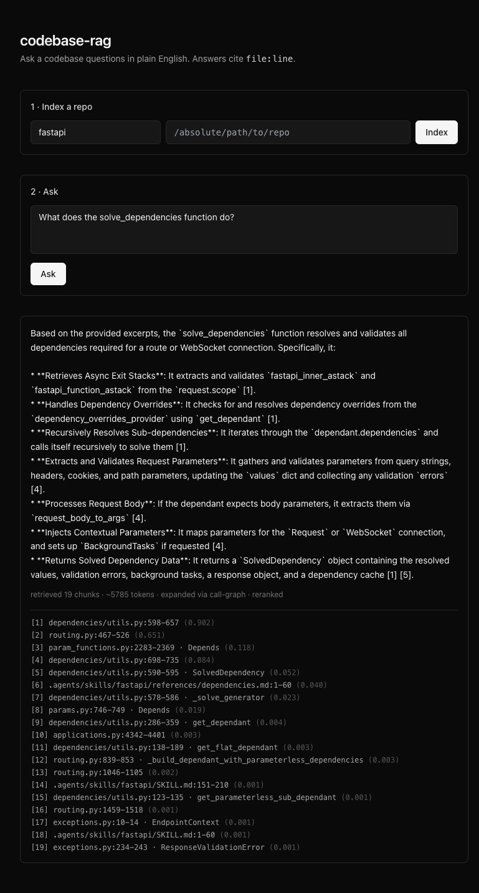

# codebase-rag

[](https://github.com/Vashu2003/codebase-rag/actions/workflows/ci.yml)

Ask any codebase questions in plain English — get answers grounded in the source, with `file:line` citations.

> _"Where is authentication handled?" · "What breaks if I change this endpoint?" · "Explain the dependency-injection system."_

Runs **fully free & offline**: local embeddings + a local LLM (Ollama), or Gemini's free API tier if you want higher answer quality without a GPU.



> _Above: FastAPI's own source ingested (53 files → 623 chunks), then asked "How does dependency injection resolve dependencies?" — answered from the code with citations to `dependencies/utils.py:598-657`, `routing.py`, and more._

---

## How it works

```
                     ┌─ vector search ── seeds ─┐
question ──▶ [embed]▶│                          ├▶ rerank ─▶ dedup ─▶ token
                     └─ graph 1-hop ─ neighbors─┘  (x-enc)            budget
                          (callers + callees)                          │
                       answer + file:line citations ◀────── [ LLM ] ◀──┘
                                          (Ollama local · or Gemini free)
```

1. **Ingest** — walk a repo, chunk it *AST-aware* (functions/classes via tree-sitter). Embed each chunk into Chroma **and** build a code graph (SQLite): an edge means "this chunk *calls* a symbol that chunk defines". Edges are **call-site aware** — only call callees (`add(...)`, `obj.method()`) and type references count, never bare attribute reads/assignments or prose, so `self.total` doesn't forge a false edge to a `total()` function.
2. **Retrieve (graph-aware)** — vector-search for seed chunks, then expand 1 hop along the graph to pull each seed's **callees/definitions and callers** — so an answer about a function also sees what it calls and what calls it, not just text-similar code.
3. **Rerank** — a cross-encoder (`bge-reranker`) re-scores the merged seed+neighbor pool on real `(question, chunk)` relevance. Bi-encoder embeddings judge each chunk in isolation (fast, coarse); the cross-encoder reads question and chunk *together* (slow, precise) — so a genuinely-relevant graph neighbor can outrank a weak vector seed instead of riding a `score × decay` guess.
4. **Compress (token-efficient)** — semantic dedup + a fixed token budget (see below) keep the prompt small; graph neighbors *replace* redundant vector hits rather than inflating it.
5. **Generate** — feed the assembled context to the LLM with a strict "cite every claim, don't guess" prompt.

## Token efficiency

Context is treated as a **fixed budget**, not "top-k whatever". Three levers, following the RAG context-compression literature:

- **Semantic dedup** — vector hits often repeat (2–3 of the top-10 say the same thing). A three-tier check (exact containment · same-file line overlap · token-overlap ≥ 0.72) collapses them.
- **Hard token budget** — candidates are added by descending relevance until `CONTEXT_TOKEN_BUDGET` (~6k) is hit; the top hit always survives.
- **Neighbor head-trim** — graph-only neighbors contribute their signature + first lines, not the whole body.

Measured on FastAPI's own source (question: *"how does dependency injection resolve dependencies?"*):

| Stage | ~tokens | chunks |
|---|--:|--:|
| naive vector top-12 | 5,719 | 12 |
| **naive graph expansion** (+14 neighbors, full text) | **11,148** | 26 |
| + semantic dedup | 8,898 | 22 |
| **+ budget + head-trim (shipped)** | **5,956** | 21 |

→ **~46% fewer tokens than naive graph expansion**, while still delivering 21 structurally-relevant chunks (call-graph neighbors included) in about the same budget as plain vector top-12. Graph context, essentially for free.

The `/query` response reports `{seeds, graph_neighbors, after_dedup, est_tokens, graph_used}`, and the UI shows *"retrieved N chunks · ~T tokens · expanded via call-graph"* so the effect is visible.

## Stack

| Layer | Choice | Free? |
|---|---|---|
| API | FastAPI | ✅ |
| Chunking | tree-sitter (AST-aware) | ✅ |
| Embeddings | `bge-small-en-v1.5` (sentence-transformers, local) | ✅ |
| Vector DB | Chroma (embedded, on-disk) | ✅ |
| Code graph | SQLite (stdlib — no dependency) | ✅ |
| Reranker | `bge-reranker-base` cross-encoder (local, optional) | ✅ |
| Answer LLM | Ollama `qwen2.5-coder:7b` **or** Gemini free tier | ✅ |
| Frontend | Next.js 15 + Tailwind | ✅ |

---

## Quickstart

### 1. Backend

```bash
cd backend
uv venv --python 3.12          # ML wheels lag the newest Python; 3.12 is safe
uv pip install -r requirements.txt
cp .env.example .env           # defaults to Ollama; edit to use Gemini
uv run uvicorn app.main:app --reload --port 8000
```

> Uses [`uv`](https://docs.astral.sh/uv/). Plain `python3.12 -m venv .venv && pip install -r requirements.txt` works too.

**LLM options** (edit `.env`):
- **Ollama (local, fully offline)** — install [ollama.com](https://ollama.com), then `ollama pull qwen2.5-coder:7b`. Keep `LLM_PROVIDER=ollama`.
- **Gemini (free tier, better answers)** — get a key at [aistudio.google.com/apikey](https://aistudio.google.com/apikey), set `LLM_PROVIDER=gemini` and `GEMINI_API_KEY=...`.

### 2. Frontend

```bash
cd frontend
npm install
cp .env.local.example .env.local
npm run dev            # http://localhost:3000
```

### 3. Try it

1. **Index a repo** — give it a name + an absolute local path (e.g. clone FastAPI: `git clone https://github.com/fastapi/fastapi`).
2. **Ask** — _"Explain how dependency injection is resolved."_ Watch it answer with exact `file:line` cites.

---

## API

| Method | Route | Body | Returns |
|---|---|---|---|
| `POST` | `/ingest` | `{ path, repo }` | `{ files_indexed, chunks_indexed }` |
| `POST` | `/query` | `{ repo, question, top_k? }` | `{ answer, citations[] }` |
| `GET` | `/health` | — | `{ status, llm_provider }` |

---

## Tests

```bash
cd backend
uv run pytest -m "not slow"   # fast unit/component suite (mocks the model + LLM)
uv run pytest -m slow         # integration: real embeddings over a fixture repo
```

The fast suite mocks the two heavy **boundaries** (embedding model, LLM) so it runs in <1s and needs no network. One `slow` integration test exercises real `bge-small` embeddings end-to-end (ingest → retrieve → cite). CI runs the fast suite plus the frontend typecheck/build/lint on every push.

## Security

This is a **single-user, localhost developer tool** — treat that as the trust boundary:

- `POST /ingest` reads files under a path you give it. Symlinks that escape the repo root are skipped, and an optional `INGEST_ROOT` env allow-list confines ingest to one directory if you ever expose the server. Per-repo `MAX_FILES` / `MAX_TOTAL_BYTES` caps guard against runaway walks.
- CORS is pinned to `http://localhost:3000`; **do not** bind the server to a public interface.
- The Gemini API key is sent as an `x-goog-api-key` header (never in a URL or request body), and API errors are logged server-side but returned to the client as generic messages — so a key or internal path can't leak through an error response.
- Query inputs are bounded (`top_k` ≤ 100, `question` ≤ 4000 chars) so a client can't force a huge Chroma result set or LLM prompt.
- Retrieved file contents are placed in the LLM prompt, so an ingested repo could contain **prompt-injection** text ("ignore the above…"). Impact is low here — no tool-calling, output returns only to the user who chose to ingest that repo — but it's inherent to RAG; don't ingest untrusted repos and trust the answer blindly.
- `npm audit` shows 2 *moderate*, build-time-only advisories in Next.js's bundled PostCSS (CSS stringify XSS). They require processing untrusted CSS through the build toolchain, which this project never does — no runtime exposure. The runtime-relevant Next.js advisories are resolved by pinning `next@15.5.x`.

## Roadmap

- [x] **Graph-aware retrieval** — fuse call-graph proximity (callers/callees) with vector similarity for sharper context.
- [x] **Token-efficient context** — semantic dedup + fixed token budget + neighbor head-trim.
- [x] **Call-site-aware edges** — only call callees + type references become edges (not bare identifiers), dropping attribute/prose false edges (fixture: 4 edges → 1, all noise removed).
- [x] **Cross-encoder reranking** — `bge-reranker-base` re-scores the merged pool on true `(question, chunk)` relevance before the budget.
- [ ] Full scope/binding resolution (shadowing, import-qualified names) to disambiguate same-named symbols across files.
- [ ] Streaming answers.
- [ ] Clickable citations that open the exact line.
- [ ] Ingest straight from a GitHub URL.

## License

MIT
